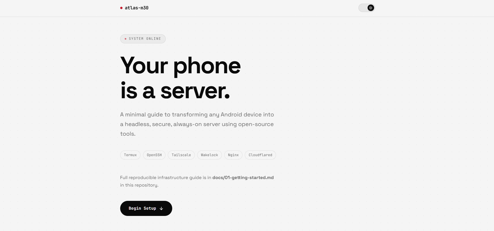
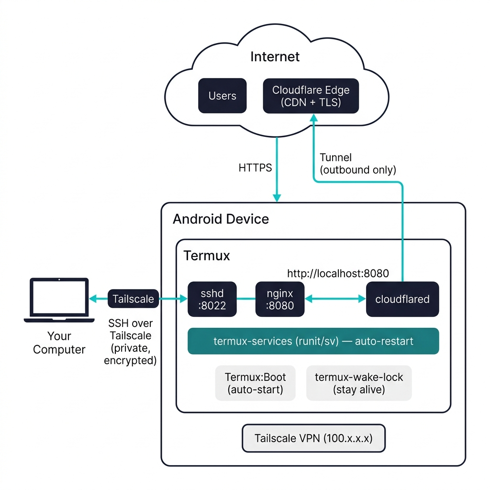

# Atlas-M30

> Turn any Android phone into a 24/7 headless server — SSH, web hosting, and a public Cloudflare tunnel, all without root.

---

<p align="center">
  
</p>

## What Is This?

Atlas-M30 is a complete, open-source guide and config kit for running a persistent server on an Android phone using [Termux](https://termux.dev). Clone this repo, copy the configs to your device, and you'll have a production-ready setup in under an hour.

### Architecture

<p align="center">
  
</p>

### The Stack

| Component | What It Does |
|---|---|
| **Termux** | Linux terminal emulator on Android |
| **OpenSSH** | Remote shell access on port 8022 |
| **Tailscale** | Private WireGuard VPN — SSH from anywhere |
| **Nginx** | Serves your static website on port 8080 |
| **Cloudflared** | Cloudflare Tunnel — public HTTPS with CDN & DDoS protection |
| **termux-services** | runit-based supervision — auto-restarts crashed services |
| **Termux:Boot** | Starts everything automatically on device reboot |

---

## 📖 Guide

The setup is split into three chapters. Follow them in order:

### [Chapter 1 — Getting Started](docs/01-getting-started.md)
> *~30 minutes · Android prep → Termux → SSH → Tailscale*

Get remote terminal access to your phone working. By the end you'll be SSHing into your phone from your laptop over a private encrypted network.

**What you'll set up:**
- Android battery & process optimization
- Termux with all required packages
- SSH server with key-based authentication
- Tailscale VPN for secure remote access

---

### [Chapter 2 — Web Server & Public Access](docs/02-services-and-deployment.md)
> *~30 minutes · Nginx → Cloudflare Tunnel → Service supervision → Boot persistence*

Turn your phone into a web server and expose it to the internet through Cloudflare. Set up auto-restart and boot persistence so it survives crashes and reboots.

**What you'll set up:**
- Nginx serving static files
- Cloudflare Tunnel for public HTTPS
- runit service supervision (auto-restart)
- Boot scripts for startup persistence
- Shell profile with health monitoring

---

### [Chapter 3 — Operations & Troubleshooting](docs/03-operations.md)
> *Reference · Quick deploy · Verification · Security · Troubleshooting*

One-shot deploy script, full verification checklist, security hardening guide, and fixes for every common issue.

**What you'll find:**
- Quick-deploy script (everything in one go)
- Post-setup verification checklist
- Security best practices (do's and don'ts)
- Troubleshooting for 8 common issues
- Config file reference table

---

## Quick Start (For the Impatient)

```bash
# On your Termux device:
pkg update && pkg upgrade -y
pkg install -y openssh nginx termux-services cloudflared termux-api jq git

cd ~
git clone https://github.com/YOUR_USERNAME/Atlas-M30.git

# Then follow the guide starting from Chapter 1 ↑
```

---

## Repo Structure

```
Atlas-M30/
│
├── docs/
│   ├── 01-getting-started.md           ← Chapter 1: Setup & SSH
│   ├── 02-services-and-deployment.md   ← Chapter 2: Web & Tunnel
│   └── 03-operations.md               ← Chapter 3: Ops & Troubleshooting
│
├── Nginx/
│   └── nginx.conf                      → $PREFIX/etc/nginx/nginx.conf
│
├── Cloudflared/
│   └── config.yml                      → ~/.cloudflared/config.yml
│
├── Services/
│   └── cloudflared/
│       └── run                         → $PREFIX/var/service/cloudflared/run
│
├── SSH/
│   └── config                          → ~/.ssh/config (on your computer)
│
├── Termux/
│   └── boot/
│       └── start-atlas-m30.sh          → ~/.termux/boot/start-atlas-m30.sh
│
├── Website/                            → ~/uptime_website/
│   ├── index.html
│   ├── style.css
│   ├── script.js
│   └── favicon.svg
│
├── .bashrc                             → ~/.bashrc
└── .gitignore
```

---

## Config Files → Device Paths

Every config file in this repo maps to a specific location on your Termux device:

| Repo File | Install To | Purpose |
|---|---|---|
| `.bashrc` | `~/.bashrc` | Shell profile, aliases, health monitor |
| `Nginx/nginx.conf` | `$PREFIX/etc/nginx/nginx.conf` | Web server config |
| `Cloudflared/config.yml` | `~/.cloudflared/config.yml` | Tunnel config (Option B) |
| `Services/cloudflared/run` | `$PREFIX/var/service/cloudflared/run` | runit service script |
| `SSH/config` | `~/.ssh/config` _(your computer)_ | SSH shortcut |
| `Termux/boot/start-atlas-m30.sh` | `~/.termux/boot/start-atlas-m30.sh` | Boot startup script |

---

## Prerequisites

| What | Where |
|---|---|
| Android device (7+) | — |
| Termux | [F-Droid](https://f-droid.org/en/packages/com.termux/) |
| Termux:Boot | [F-Droid](https://f-droid.org/en/packages/com.termux.boot/) |
| Termux:API | [F-Droid](https://f-droid.org/en/packages/com.termux.api/) |
| Tailscale | [tailscale.com](https://tailscale.com/download) |
| Cloudflare account | [dash.cloudflare.com](https://dash.cloudflare.com/sign-up) (free) |

> ⚠️ Install **all** Termux apps from **F-Droid**. Play Store and F-Droid builds use different signing keys and are **incompatible** with each other.

---

## Security

- All credentials have been replaced with **placeholders** — no real secrets in this repo
- The [`SSH/config`](SSH/config) file goes on your **computer**, not the phone
- SSH access is only exposed via **Tailscale** (private network), never the public internet
- See [Chapter 3 → Security](docs/03-operations.md#3-security-best-practices) for the full hardening guide

---

## License

This project is provided as-is for educational and personal use. This is under MIT License.
